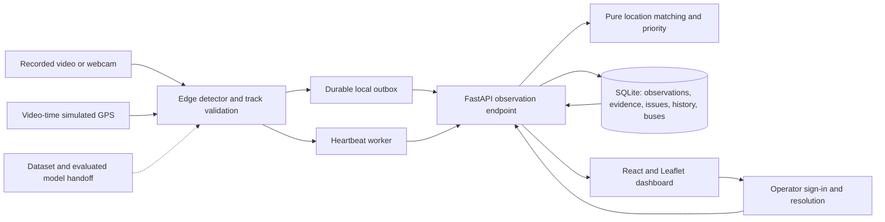

# Architecture

The edge owns frame tracking and stable event IDs. The backend owns retry
deduplication, transactions, persistence and issue counts. The location package
accepts candidate records and never accesses the database. The frontend displays
backend aggregates and never derives city totals from one page of results.

Full camera frames and video are not sent to the backend. Optional `--save-evidence`
attaches a compact pothole crop to an observation and the durable retry payload. Metadata includes approximate bus
coordinates with explicit source, UTC time, confidence and optional box. Physical
severity is unknown. Source-specific matching prevents simulated reports from being
combined with real GPS observations.
